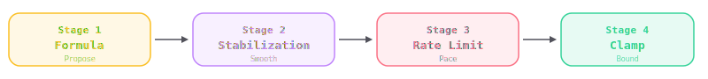
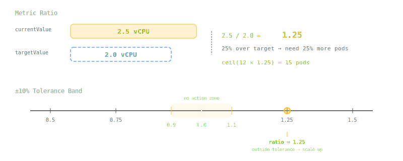
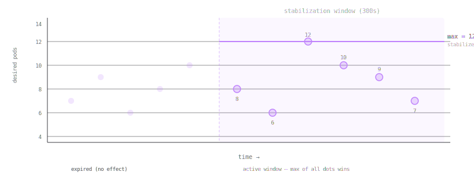
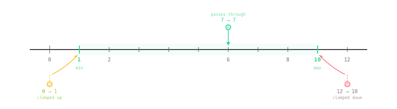
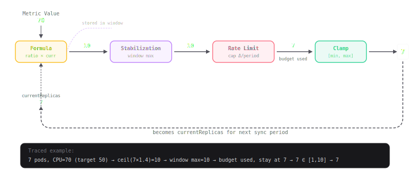

The Horizontal Pod Autoscaler (HPA) automatically adjusts the number of pod replicas in a deployment based on observed metrics. Every **sync period** (default: 15 seconds), it runs a four-stage pipeline to decide whether to scale up, scale down, or do nothing.



This article walks through each stage, building the full picture incrementally.

---

## Stage 1: The Formula — Metric Ratio × Current Pods

The HPA watches a metric you define — CPU utilization, request rate, custom metrics — and you tell it a **target** value. This target is your 100% baseline.

**Example:** You want each pod to use about 2 vCPU, so you set target = 2 vCPU.

Every sync period, the HPA reads the current metric value, computes the **ratio** (`currentValue / targetValue`), and multiplies current replicas by that ratio:

```
desiredReplicas = ceil(currentReplicas × currentValue / targetValue)
```

**Concrete example:** You have 12 pods, target is 2 vCPU, current CPU is 2.5 vCPU.

```
ratio = 2.5 / 2.0 = 1.25  (25% over target)
desired = ceil(12 × 1.25) = ceil(15) = 15 pods
```

The metric is 25% over target, so we need 25% more pods. This works for scale-down too: if CPU drops to 1.5 vCPU, ratio = 0.75, desired = ceil(12 × 0.75) = 9 pods.



### The ±10% Tolerance Band

The HPA doesn't react to tiny fluctuations. If the ratio is within **±10% of 1.0** (i.e., between 0.9 and 1.1), it does nothing. This prevents constant micro-adjustments when the metric hovers near the target.

### Multiple Metrics

If you configure multiple metrics (e.g., CPU and memory), the HPA computes desired replicas for each metric independently and takes the **maximum**. This ensures you have enough pods to satisfy the most demanding metric.

### The Feedback Loop

The formula uses *current replicas* as input, which creates a feedback loop. If the HPA scaled to 15 last sync, the formula uses 15 as its starting point next sync. This means desired replicas can overshoot — if the metric is still high but declining, the formula may compute an even higher number because it's multiplying against more replicas.

---

## Stage 2: Stabilization — "Don't Panic"

### The Problem

The raw formula output can be noisy. One sync period says 20 pods, the next says 5, the next says 18. If the HPA acted on every fluctuation immediately, replicas would bounce up and down constantly — **flapping**.

### The Solution: Look Back Before Acting

Stabilization keeps a **sliding window** of recent raw desired values (the Stage 1 outputs — the unfiltered proposals, not the results of previous stages). Before acting, it looks at the last N seconds of recommendations and picks a conservative value.

Why does it look at raw values and not filtered ones? Because if it only saw the already-smoothed output, it would have nothing to smooth. It needs to see the actual noise to filter it out.

There are **two separate windows**, one for each direction:

**Scale-down stabilization** (default: 300 seconds / 5 minutes):
- Looks at all raw desired values within the window
- Picks the **maximum** — the highest recent recommendation
- Logic: "Someone recently said we need a lot of pods. Don't rush to remove them."

**Scale-up stabilization** (default: 0 seconds — disabled):
- Looks at all raw desired values within the window
- Picks the **minimum** — the lowest recent recommendation
- Logic: "Even the most conservative recent recommendation says we need at least this many."

The current desired value is included in the window — it's pushed into the history before the window is evaluated.



The shaded region is the stabilization window. Dots show raw desired values from Stage 1 at each sync point — some high, some low. The solid line at the top is the stabilized output: the **max** of all dots within the window (for scale-down). It won't drop until the high values expire from the window.

### What Stabilization Does NOT Do

- It does **not** change the formula output. Stage 1 still computes the same raw desired each tick.
- The stabilized value does **not** feed back into the next tick's formula. The formula always uses the *actual* replica count (after all four stages).
- It only filters the *recommendation*. The actual scaling decision still goes through rate limiting and clamping.

---

## Stage 3: Rate Limiting — "Speed Limit on Scaling"

### The Problem

Even with stabilization smoothing out the recommendation, the HPA might want to make large jumps. If you're at 3 pods and stabilization says you need 20, jumping straight to 20 could overwhelm your infrastructure — thundering herd, resource contention, cascading failures.

### The Solution: Cap How Fast Replicas Can Change

Rate limiting defines **policies** — rules that limit how many replicas can be added or removed within a time window. Think of it as a speed limit: even if the destination is far away, you can only drive so fast.

Each policy has three parts:
- **Type**: `Pods` (absolute number) or `Percent` (proportion of current count)
- **Value**: how much change is allowed
- **Period**: the time window to measure against (in seconds)

**Example with Pods:** "Max +4 pods per 60 seconds" — if you already added 2 pods in the last 60 seconds, you can only add 2 more this tick.

**Example with Percent:** "Max +50% per 60 seconds" — if you started the period at 10 pods, you can scale up to at most 15 (10 × 1.5).


The staircase shows how rate limiting works in practice. The desired value sits at 10 (dashed line), but the actual replicas climb one step at a time. Each sync period, the rate limiter checks the budget — if the policy allows +1 pod per 60s, that's all you get per tick.

### Period Start Replicas

The key concept in rate limiting is **period start replicas** — "where were we at the start of this policy's time window?" The HPA computes this by rewinding through recent scale events:

```
periodStartReplicas = currentReplicas - replicasAddedInPeriod + replicasDeletedInPeriod
```

If you already used some of your "budget" for the period, the remaining budget is smaller.

### Multiple Policies and selectPolicy

You can define multiple policies per direction. The `selectPolicy` field controls how they combine:

- **Max** (default for scale-up): pick the most permissive policy — allows the most change
- **Min**: pick the most restrictive policy — allows the least change
- **Disabled**: skip rate limiting entirely for this direction

Rate limiting doesn't have its own timer. It's evaluated at every sync period. The `periodSeconds` on a policy is just a lookback window.

---

## Stage 4: Clamping — The Safety Net

After the formula, stabilization, and rate limiting have all had their say, clamping enforces the hard boundaries:

```
actual = max(minReplicas, min(maxReplicas, rateLimitedValue))
```

If the pipeline computed 100 pods but `maxReplicas` is 50, the actual becomes 50. If it computed 0 but `minReplicas` is 2, the actual becomes 2.



### Clamping Is Applied Last

This ordering matters. The entire pipeline runs fully — the formula might say 100, stabilization confirms 100, rate limiting allows 100 — and only at the very end does clamping say "nope, max is 50."

The consequence: **the stabilization window still remembers that 100.** Since stabilization looks at raw Stage 1 outputs (not clamped values), future scale-down decisions will be held by that high recommendation until it expires from the window. Clamping doesn't erase the signal — it just prevents the actual scaling from exceeding bounds.

---

## The Full Pipeline

Every sync period (default 15 seconds), the HPA runs all four stages in sequence. The only feedback loop: the final actual replica count becomes `currentReplicas` for the next sync.



### Tracing a Single Sync Period

Say we have 7 pods, CPU is at 70 (target 50), scale-down stabilization window is 180s, rate limit is +1 pod per 60s:

1. **Stage 1:** `ceil(7 × 70/50) = ceil(9.8) = 10` → raw desired = 10
2. **Stage 2:** Look back 180s. Recent raw desires: [8, 7, 6, 10]. For scale-up, min of window = 6. Since current (7) > 6, no constraint. → stabilized = 10
3. **Stage 3:** Policy: +1 pod per 60s. Period start replicas = 6 (rewound from 7, found a +1 event). Limit = 6 + 1 = 7. Desired is 10 > current 7, so up-limit applies: min(10, 7) = 7. → rate limited = 7 (no change, budget exhausted)
4. **Stage 4:** min=1, max=10. 7 is within bounds. → actual = 7

Next sync period, if the rate limit budget has refreshed, we might get to add +1.

---

## Configuring the Behavior API

All stabilization and rate limiting is configured through the HPA's `behavior` field:

```yaml
apiVersion: autoscaling/v2
kind: HorizontalPodAutoscaler
metadata:
  name: my-app
spec:
  scaleTargetRef:
    apiVersion: apps/v1
    kind: Deployment
    name: my-app
  minReplicas: 1
  maxReplicas: 50
  metrics:
    - type: Resource
      resource:
        name: cpu
        target:
          type: Utilization
          averageUtilization: 50
  behavior:
    scaleUp:
      stabilizationWindowSeconds: 0          # No delay on scale-up (default)
      policies:
        - type: Pods
          value: 4
          periodSeconds: 60                  # Max +4 pods per 60s
        - type: Percent
          value: 100
          periodSeconds: 60                  # Max +100% per 60s
      selectPolicy: Max                      # Use the most permissive policy
    scaleDown:
      stabilizationWindowSeconds: 300        # 5 min cooldown (default)
      policies:
        - type: Percent
          value: 10
          periodSeconds: 60                  # Max -10% per 60s
      selectPolicy: Max
```

### Key Defaults

| Setting | Scale-Up Default | Scale-Down Default |
|---------|------------------|--------------------|
| Stabilization Window | 0s (immediate) | 300s (5 minutes) |
| Policies | +4 pods/15s, +100%/15s | -100%/15s |
| Select Policy | Max | Max |

The asymmetric defaults reflect Kubernetes' philosophy: **scale up quickly** (don't lose traffic) but **scale down cautiously** (don't kill pods you might need in a minute).

---

## Summary

| Stage | Input | Output | Purpose |
|-------|-------|--------|---------|
| **1. Formula** | Metric value, current replicas | Raw desired replicas | "How many pods does the math say we need?" |
| **2. Stabilization** | Raw desired + history window | Stabilized desired | "Is it safe to act on this, or is it noise?" |
| **3. Rate Limiting** | Stabilized desired + event history | Constrained desired | "How fast are we allowed to get there?" |
| **4. Clamping** | Constrained desired | Actual replicas | "Are we within [min, max] bounds?" |

Each stage is a filter. The formula proposes, stabilization smooths, rate limiting paces, and clamping bounds. Together, they transform a noisy metric signal into controlled, predictable scaling behavior.
