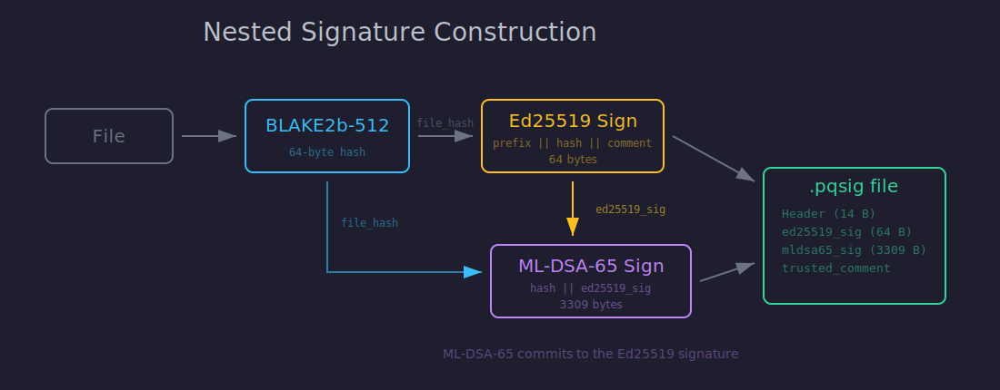
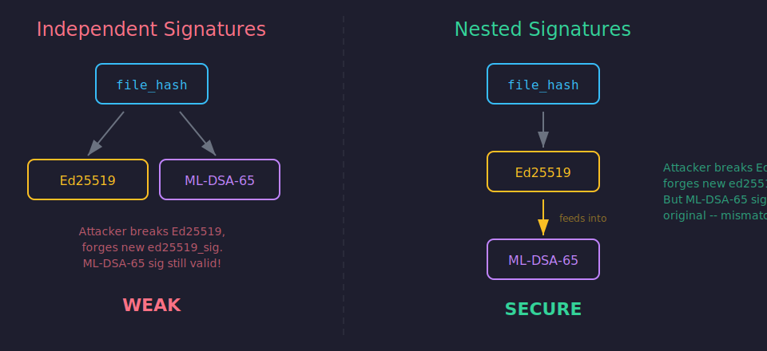
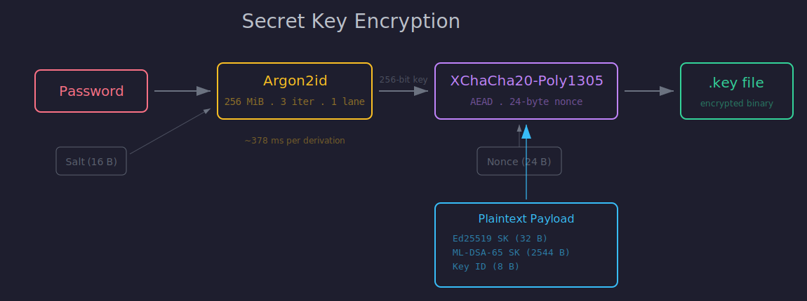

Quantum computers don't break all of cryptography — just the parts we rely on most. RSA, ECDSA, Ed25519: all built on problems that a sufficiently powerful quantum machine solves in polynomial time via Shor's algorithm. Symmetric ciphers and hash functions survive with larger key sizes, but our digital signatures do not.

NIST spent eight years running a competition to find replacements. In 2024 they finalized three standards, including **FIPS 204 (ML-DSA)** for digital signatures. The algorithms are ready — and the industry is moving: [Google is shipping hybrid ML-DSA signatures in Android 17](https://security.googleblog.com/2026/03/post-quantum-cryptography-in-android.html) across Verified Boot, Keystore, and app signing. The question is how to adopt them without betting everything on primitives that have existed for less than two years.

I built [pqsign](https://github.com/pscheid92/pqsign) to answer that question for file signing. This post walks through the cryptographic design: why hybrid signatures, how the nesting works, and what keeps the secret keys safe at rest.

---

## The Hybrid Bet

The safest migration strategy is to not migrate at all — at least not exclusively. A **hybrid signature** pairs a classical algorithm (Ed25519) with a post-quantum one (ML-DSA-65). Both must verify for a file to be accepted.

This gives you a simple security guarantee: **if either algorithm holds, the signature holds.** Ed25519 has decades of cryptanalysis behind it. ML-DSA-65 is built on the Module Learning With Errors problem, which has resisted attack since Regev introduced LWE in 2005. You'd need both to fall simultaneously to forge a pqsign signature.

### Why Ed25519?

Ed25519 is the most widely deployed modern signature scheme. It's fast, has a small key/signature footprint (32-byte keys, 64-byte signatures), and has a clean, well-studied security proof. It's the obvious classical half.

### Why ML-DSA-65?

ML-DSA (formerly CRYSTALS-Dilithium) is the NIST primary standard for post-quantum signatures. Level 65 targets NIST Security Level 3 — roughly equivalent to AES-192.

Why not Level 87 (the strongest)? Signatures grow from 3309 bytes to 4627 bytes — a 40% increase — for a security margin most threat models don't need. Level 3 already provides substantial resistance against both known classical and quantum attacks. For file signing, where signatures are stored alongside files rather than transmitted in tight protocol messages, 3309 bytes is comfortable.

---

## The Signature Construction



The naive approach to hybrid signatures is to sign the file independently with both algorithms and concatenate the results. This is fragile. An attacker who breaks one algorithm can replace that component while leaving the other intact. You'd still have "two valid signatures," but one of them is forged.

pqsign uses **nesting** instead. The ML-DSA-65 signature commits to the Ed25519 signature, creating an interdependency that prevents selective replacement.

Here's the full construction:

```
1. file_hash   = BLAKE2b-512(file)

2. ed25519_msg = "pqsign-ed25519" || file_hash || trusted_comment
   ed25519_sig = Ed25519.Sign(sk_ed, ed25519_msg)

3. mldsa65_msg = file_hash || ed25519_sig
   mldsa65_sig = ML-DSA-65.Sign(sk_ml, mldsa65_msg, ctx = "pqsign-mldsa65")
```

The final signature file contains both `ed25519_sig` (64 bytes) and `mldsa65_sig` (3309 bytes), for a total of **3373 bytes**.

### Why Nesting Works



If an attacker breaks Ed25519 and forges a new `ed25519_sig`, they also need to update `mldsa65_sig` — because ML-DSA-65 signed the original Ed25519 signature bytes. Without the ML-DSA-65 secret key, they can't produce a matching outer signature.

If an attacker breaks ML-DSA-65, they can forge `mldsa65_sig` — but the Ed25519 signature still binds the file hash and trusted comment to the Ed25519 key. The forged outer signature doesn't help them change what the inner signature committed to.

Both layers have to fall for a forgery to succeed. Independent signatures can't make this guarantee.

### Domain Separation

Each algorithm signs within its own domain to prevent cross-protocol attacks:

- **Ed25519** prepends the literal string `"pqsign-ed25519"` to the message before signing. This ensures an Ed25519 signature produced for pqsign can't be replayed in a different protocol that also uses Ed25519.
- **ML-DSA-65** uses the FIPS 204 context string mechanism with `"pqsign-mldsa65"`. This is a first-class feature of the standard — the context is mixed into the signing process, not just prepended.

### File Prehashing: BLAKE2b-512

Files are hashed before signing rather than fed directly to the signature algorithms. This serves two purposes:

1. **Streaming.** The file never needs to be loaded entirely into memory. BLAKE2b processes it in chunks, producing a fixed 64-byte digest regardless of file size.
2. **Performance.** Hashing 100 MiB takes about 106 ms. The actual signing (Ed25519 + ML-DSA-65) takes under 0.5 ms. The hash dominates, and BLAKE2b is one of the fastest cryptographic hash functions in software — faster than SHA-512 on most platforms.

What about quantum resistance of the hash? Grover's algorithm can search a hash space in O(2^(n/2)), reducing BLAKE2b-512's security from 256 bits to 128 bits in the quantum setting. That's still more than sufficient — brute-forcing 2^128 operations remains firmly infeasible.

---

## Protecting Secret Keys at Rest



A signature scheme is only as strong as its key management. pqsign encrypts secret keys with a password-derived key, using a two-layer construction: **Argon2id** for key derivation and **XChaCha20-Poly1305** for authenticated encryption.

### Argon2id: The Memory-Hard KDF

Argon2 won the Password Hashing Competition in 2015 and was standardized as RFC 9106. The `id` variant combines the side-channel resistance of Argon2i with the GPU resistance of Argon2d.

pqsign's parameters:

| Parameter | Value |
|-----------|-------|
| Memory | 256 MiB |
| Iterations | 3 |
| Parallelism | 1 lane |
| Salt | 16 bytes (random per key) |

**Why 256 MiB?** Memory is the bottleneck. A GPU can compute billions of SHA-256 hashes per second, but it can't run billions of 256 MiB allocations in parallel. An RTX 4090 with 24 GB of VRAM can run about 96 Argon2id instances simultaneously — roughly the same throughput as 100 CPU cores. Memory-hardness turns a massively parallel device into a modestly parallel one.

At these parameters, a single derivation takes about 378 ms on a modern CPU. That's roughly **2.6 attempts per second** per core. For context:

| Password | Attempts | Time (1 core) |
|----------|----------|---------------|
| 4-digit PIN | 10,000 | 32 minutes |
| 6-char lowercase | ~309 million | 3.8 years |
| 8-char alphanumeric | ~218 trillion | 1.33 million years |
| 4-word diceware | ~3.66 quadrillion | 22.3 million years |

The lesson: Argon2id buys you time, but it doesn't fix weak passwords. Use a passphrase.

### XChaCha20-Poly1305: The AEAD Cipher

The derived 256-bit key encrypts the secret key material using XChaCha20-Poly1305, an authenticated encryption scheme. The `X` prefix means extended nonce — 24 bytes instead of the 12 bytes used by standard ChaCha20-Poly1305 or AES-GCM.

Why does nonce size matter? With a 12-byte nonce and random generation, you hit a meaningful collision probability after about 2^32 encryptions under the same key. With 24 bytes, you'd need 2^48 — a non-issue for a key file that's encrypted once.

The Poly1305 authenticator serves double duty: it detects both tampering (someone modifying the ciphertext) and wrong passwords (decryption with the wrong key produces garbage that fails authentication). There's no need for a separate integrity check.

### What Gets Encrypted

The encrypted payload contains:

```
 32 bytes: Ed25519 secret key
2544 bytes: ML-DSA-65 secret key
   8 bytes: Key ID (for cross-referencing with public key)
─────────
2584 bytes total
```

The salt and nonce are stored in the file header in plaintext — they don't need to be secret, only unique.

### Memory Hygiene

Secret keys implement `ZeroizeOnDrop`. When a `SecretKey` value goes out of scope, its memory is overwritten with zeros before being freed. The same applies to passwords (`Zeroizing<String>`) and any intermediate buffers holding decrypted material (`Zeroizing<Vec<u8>>`). This doesn't protect against a determined attacker with memory access, but it minimizes the window where secrets are resident.

---

## The File Format

All pqsign files — public keys, secret keys, and signatures — share a 14-byte binary header:

```
Offset  Size  Field
0       4     Magic bytes: "PQSN"
4       1     Format version (currently 1)
5       1     File type (0x01 = public, 0x02 = secret, 0x03 = signature)
6       8     Key ID
```

The **Key ID** is 8 random bytes generated alongside the keypair. It ties public keys, secret keys, and signatures together so you can detect mismatches before attempting cryptographic operations.

Public keys are the only text-based format — base64-encoded with a `pqsign:v1:` prefix, producing a single line suitable for pasting into a config file or chat message. Secret keys and signatures are binary.

Signatures include a **trusted comment** (up to 1024 bytes) that records the timestamp, filename, and an optional user-provided message. The trusted comment is covered by the Ed25519 signature — modifying it invalidates the signature.

---

## Performance in Practice

The performance profile has a clear shape: Argon2id dominates signing, and BLAKE2b dominates large-file hashing. The actual cryptographic signing and verification is negligible.

| Operation | Empty file | 100 MiB file |
|-----------|-----------|-------------|
| Generate (with encryption) | ~379 ms | — |
| Sign (with key decryption) | ~380 ms | ~486 ms |
| Verify | < 1 ms | ~106 ms |

Verification is fast because it only needs the public key — no password, no Argon2id. This matters for the common case: you sign once, but many people verify.

---

## Trade-Offs and Limitations

pqsign makes deliberate trade-offs worth acknowledging:

- **No algorithm agility.** The algorithm pair is fixed at Ed25519 + ML-DSA-65. This is intentional — algorithm negotiation is a source of downgrade attacks. If a stronger pair is needed in the future, it would be a new format version.
- **No streaming signatures.** The file must be fully hashed before signing. For most files this is fine; for multi-gigabyte files, you'll wait for the hash.
- **BLAKE2b is not a post-quantum hash** in the strictest sense. But with 256 bits of post-quantum security (after Grover), it doesn't need to be.

---

## Wrapping Up

Post-quantum cryptography isn't a future problem — NIST finalized the standards, and the migration window is now. Hybrid signatures let you adopt the new primitives without abandoning the ones that have proven themselves over decades.

If you want to try it: `cargo install pqsign`, generate a keypair, sign a file. The [source](https://github.com/pscheid92/pqsign) and [cryptography docs](https://github.com/pscheid92/pqsign/tree/main/docs) have the full details.
