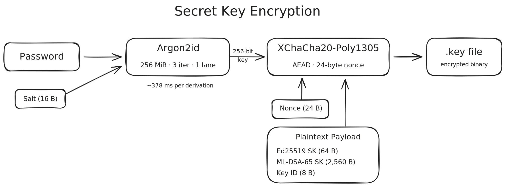

# Signing Files for a Post-Quantum World

## Post-Quantum Threats to Digital Signatures

The good news is that quantum computers don’t break all cryptography. The bad news is that they break the parts we rely on most. All the famous asymmetric algorithms, like RSA, ECDSA, and Ed25519, depend on mathematical problems such as integer factorisation and discrete logarithm. These are all efficiently solved by a sufficiently powerful quantum computer via Shor’s algorithm. Symmetric cyphers and hash functions survive, as long as their key sizes are large enough, as Grover’s algorithm basically cuts the key size in half. For most people, this is a distant concern. But the “harvest now, decrypt later” threat is real. Adversaries just have to wait until the hardware catches up.

Signal already updated its famous Double Ratchet algorithm to a quantum-resistant version in 2025. Google recently announced that it will ship hybrid quantum-resistant signatures in Android 17.

The NIST (National Institute of Standards and Technology) anticipated this and spent eight years running public competitions to find replacement algorithms. In 2024, they finalised three post-quantum cryptography standards, and a fourth is on its way. Among them is FIPS 204 ML-DSA (formerly known as Dilithium), a digital signature algorithm based on modular lattice mathematics that resists classical and quantum-computer attacks.

With this in mind, I created pqsign to sign files in a post-quantum world.

## Usage Overview

Before getting into the cryptography, here’s what pqsign actually looks like. Three commands cover the entire workflow.

Generate a keypair:

```
~ ❯ pqsign generate
Password:
Confirm password:
Generating key pair...
Secret key: /Users/you/.pqsign/default.key
Public key: /Users/you/.pqsign/default.key.pub
Key ID:     D76D7D6E21F75E86
```

Sign a file:

```
~ ❯ pqsign sign somefile.txt
Password:
Signature:  somefile.txt.pqsig
Secret key: /Users/you/.pqsign/default.key
```

Verify it:

```
~ ❯ pqsign verify somefile.txt
Signature: OK
Trusted comment: timestamp:1775165618 file:somefile.txt
Public key: /Users/you/.pqsign/default.key.pub
```

That’s it. Under the hood, pqsign generates a hybrid keypair that combines Ed25519 and ML-DSA-65, encrypts the secret key with your password, and produces nested signatures that bind the two algorithms together. The rest of this post explains what that means and why it matters.

## Hybrid Signature Design

Since modular lattice-based post-quantum cryptography is not yet battle-tested, the safest way to adopt it is not to abandon classical cryptography yet. This mixed approach, usually called the hybrid approach, pairs a classical algorithm with a post-quantum one. The file is only accepted when both signatures verify. If either algorithm remains secure, the overall signature is secure.

In pqsign, Ed25519 is the classic algorithm. It’s widely used, has been studied for decades, and is known for being fast and compact. Public keys are 32 bytes, and signatures are 64 bytes. Its security is well understood.

The post-quantum signature algorithm we use is ML-DSA-65, which is based on the Module Learning with Errors (MLWE) problem, a mathematical method studied since 2005 and believed to resist classical and quantum threats. The “65” in its name refers to the parameter set targeting NIST Security Level 3, roughly equivalent to AES-192. There is a stronger option, ML-DSA-87 (targeting Security Level 5), but it bumps the already lengthy signatures from 3,309 bytes to 4,627 bytes. That's a 40% increase in signature size for a security margin beyond what most threat models require.

## Nested Signature Construction

We need both signatures to be inseparable. If one can be swapped out without invalidating the other, the hybrid guarantee falls apart. pqsign achieves this through nesting: the ML-DSA-65 signature covers both the file and the Ed25519 signature, creating an interdependency between the two layers.

First, we create a file hash by using BLAKE2b-512, producing a fixed 64-byte digest regardless of file size. The file is streamed through BLAKE2b in chunks, so it never needs to be loaded into memory entirely. It’s also fast—about 106 ms for 100 MiB. The actual cryptographic signing after that takes under 0.5 ms. As for quantum-resistance of the hash, BLAKE2b-512 produces a 512-bit digest, which gives 256 bits of collision resistance classically. Grover’s algorithm halves that again to 128 bits in the quantum setting. Still firmly infeasible to brute-force.

Then Ed25519 signs this hash along with a trusted comment, a small metadata field that records the timestamp, filename, and optionally a user-provided text. Finally, ML-DSA-65 signs the file hash and the Ed25519 signature together.


```
1. file_hash   = BLAKE2b-512(file)

2. ed25519_msg = "pqsign-ed25519" || file_hash || trusted_comment
   ed25519_sig = Ed25519.Sign(sk_ed, ed25519_msg)

3. mldsa65_msg = file_hash || ed25519_sig
   mldsa65_sig = ML-DSA-65.Sign(sk_ml, mldsa65_msg, ctx = "pqsign-mldsa65")
```

Each algorithm uses its own signing domain to prevent cross-protocol attacks. Ed25519 prepends the literal string "pqsign-ed25519" to every message it signs. ML-DSA-65 uses the context string mechanism from FIPS 204, passing "pqsign-mldsa65". This means a signature created by pqsign can’t be reused in a different protocol that happens to use the same algorithms.

What happens if one of the algorithms breaks?

**If Ed25519 breaks,** an attacker can forge a new ed25519_sig. But the ML-DSA-65 signature was computed over the original Ed25519 signature bytes. Without the ML-DSA-65 secret key, they can’t produce a matching outer signature. The forgery is caught.

**If ML-DSA-65 breaks,** an attacker can forge a new mldsa65_sig. But the Ed25519 signature still binds the file hash and trusted comment to the Ed25519 key. The forged outer signature doesn’t help. It can’t change what the inner signature committed to.

Both layers have to fall for a forgery to succeed.

## Secret Key Protection at Rest

A signature scheme is only as strong as its secret key storage. If someone can steal the secret key off your disk, they can sign whatever they want. Thus, pqsign encrypts the secret key with a password-derived key. It uses Argon2id for key derivation from a user-provided password and XChaCha20-Poly1305 for authenticated encryption.



**Argon2id** won the Password Hashing Competition in 2015 and is standardised as RFC 9106. The “id” variant combines the side-channel resistance of Argon2i with the GPU resistance of Argon2d. pqsign uses 256 MiB of memory, 3 iterations, and 1 degree of parallelism.

A GPU can compute billions of SHA-256 hashes per second, but it can't run billions of 256 MiB allocations in parallel. An RTX 4090 with 24 GB of VRAM tops out at about 96 simultaneous Argon2id instances. That buys you time, but it doesn't fix weak passwords.

**XChaCha20-Poly1305** handles the actual encryption of the secret key. It's an authenticated cypher, meaning any tampering with the ciphertext or a wrong password is detected automatically. No separate integrity check is needed.

Secret keys are zeroed in memory as soon as they go out of scope. This doesn't stop a determined attacker with direct memory access, but it shrinks the window during which secrets sit around in memory.

## Performance Characteristics

Signing performance is dominated by Argon2id. It takes about 378 ms to derive the encryption key and decrypt the secret key from disk. For large files, BLAKE2b adds to that—roughly 106 ms for 100 MiB. The actual cryptographic signing, meaning Ed25519 and ML-DSA-65 together, takes under 0.5 ms. This is negligible in comparison.

Verification is a different story. It only needs the public key, so no password prompt, no Argon2id key derivation. This asymmetry is by design: you sign a file once, but potentially many people verify it. The expensive part happens once on the signer's side. The cheap part happens on every verifier's side.

## Deliberate Constraints

pqsign makes a few deliberate trade-offs worth explaining.

**Fixed algorithms:**
The algorithm pair is fixed: Ed25519 + ML-DSA-65. There is no negotiation, no configuration flag, no way to swap in a different algorithm at runtime. Algorithm negotiation is a well-known source of downgrade attacks. Every option you add is an option an attacker can exploit. If a different pair is needed in the future, it will be a new format version, not a runtime option.

**No streaming signatures:**
The entire file must be hashed before signing begins. For most files, this is imperceptible. For multi-gigabyte files, you wait for the hash to complete. That's the trade-off for keeping the construction simple and memory usage constant.

## Conclusion

Post-quantum cryptography is not a problem for the future. The standards are finalised, the industry is already migrating, and the window to start is open. Hybrid signatures let you adopt new primitives without abandoning those that have proven themselves over decades. If either algorithm holds, you're safe.

```
cargo install pqsign
```

The [source code](https://github.com/pscheid92/pqsign) and [cryptography documentation](https://github.com/pscheid92/pqsign/tree/main/docs) have the full details.
